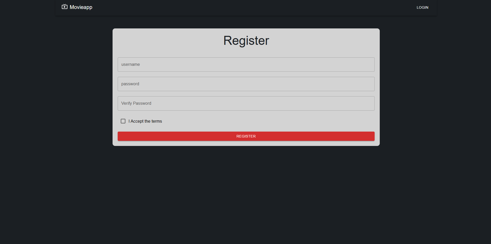
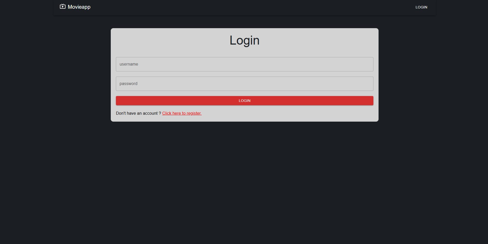
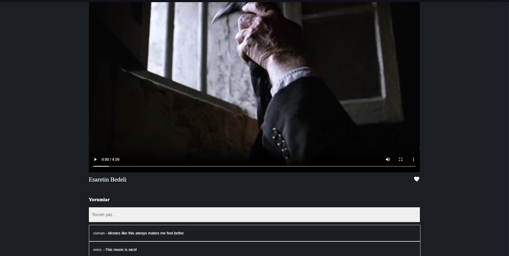

# Movie App :clapper:

Full-stack movie web application built with **Spring Boot**, **React**, **Redux**, **JWT Authentication**, **Spring Security**, **MySQL**, and **Material-UI**.

## Features

### Authentication
- **Register** a new user.
- **Authenticate** existing users with secure **JWT** tokens.

### User Preferences
- **Like a movie**.
- **Unlike a movie** (remove like).
- **Retrieve liked movies**.

### Comments
- **Add comments** to movies.
- **Delete comments**.
- **View all comments** for a movie.

### Movies
- **Fetch all movies**.
- **Search for movies**.

### Categories
- **Fetch movies by category**.

## Tech Stack

- **Backend**: Spring Boot, Spring Security, JWT
- **Frontend**: React, Redux, Material-UI
- **Database**: MySQL
- **Authentication**: JWT Token based authentication

## Project Structure

```
/backend
  ├── src/main/java
  │    └── com/yourapp
  │         ├── controllers
  │         ├── services
  │         ├── models
  │         ├── repositories
  │         └── security
  └── resources
       └── application.properties

/frontend
  ├── src
  │    ├── components
  │    ├── pages
  │    ├── redux
  │    ├── services
  │    └── utils
```

## Installation

### Prerequisites
- Java 21+
- Node.js 22+
- MySQL server

### Backend Setup
```bash
# Go to backend directory
cd backend

# Install dependencies (if any via Maven)
mvn clean install

# Configure `application.properties`
spring.datasource.url=jdbc:mysql://localhost:3306/your_db
spring.datasource.username=your_username
spring.datasource.password=your_password
spring.jpa.hibernate.ddl-auto=update
jwt.secret=your_jwt_secret_key

# Run the server
mvn spring-boot:run
```

### Frontend Setup
```bash
# Go to frontend directory
cd frontend

# Install node modules
npm install

# Start React App
npm start
```

!!Video samples are not included due to copyright reasons.
 İf you want to see movie images and movie videos, you need to add it in:
 "/frontend/movie-app/src/files/images" and
 "/frontend/movie-app/src/files/movies".
 You need to configure the movie paths in the database.
 Video samples are not included due to copyright reasons.


## Screenshots

 
  
 
 

 > ⚠️ The posters and images used in this project are for non-commercial, educational and demonstrational purposes only. All copyrights belong to their respective owners.


